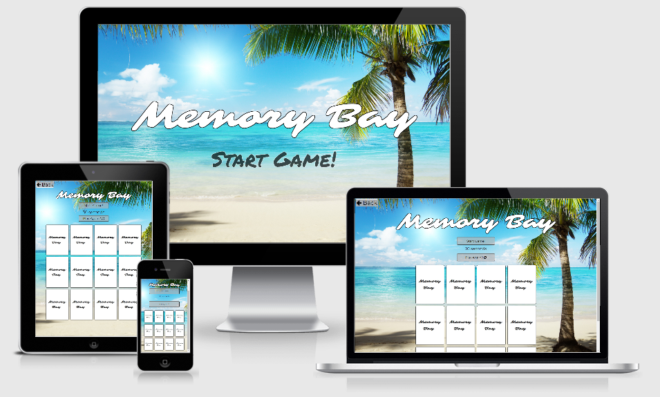

# Milestone Project Two - Memory Bay

For my second project to display my skills in JavaScript I have created a memory card game with a theme reflecting my favourite place to be this year, the beach.

I have used a mix of HTML, CSS and JavaScript to create this interactive game. 

[Click here to view My Project](https://amykeedwell.github.io/2-Milestone-Project-Memory-Bay/)

[Click here to view my Repository](https://github.com/AmyKeedwell/2-Milestone-Project-Memory-Bay)

# UX

This game is designed to be a relaxing game aimed at all age groups. 

# Features

# Technologies Used

This project makes use of:

* HTML
    * HTML for structure.
* CSS
    * CSS for Styling.
* Google Chrome
    * Used for browser and dev tools.
* Google
    * Google was used for research.
* Google Fonts
    * Used for typogrphy
* Bootstrap
    * HTML and CSS Framework, Grid System - Columns and Rows from Bootstrap.
* Font Awesome
    * Used to add icons throughout the page.
* Figma
    * Used to make my final wireframe.
* Git
    * Git used for Version Control.
* GitHub
    * Repository hosted on GitHub.
* Github Pages
    * Website hosted on Github Pages.
* Am I Responsive
    * Testing responsiveness of the website.
* HTML Validator
    * Validated HTML code by direct input to check for any errors.
* CSS Validator
    * Validated CSS code by direct input to check for any errors.
* HTML Formatter
    * Checked that HTML code is formatted and indented correctly.

# Testing

# Deployment
The project is hosted on GitHub Pages

The process involved:

* Host a git repository on GitHub.

* Create project in GitPod saving each big change for version control to GitHub.

* Open your project repository in GitHub.

* Click on settings.

* Scroll down to the GitHub Pages section.

* Click on source and select master branch.

* After the page refreshes you will have a link to your deployed website.

* Final product now hosted on GitHub Pages.

To deploy your own version of the website:

* Have git installed

* Visit the repository

* Click 'Clone or download' and copy the code for http

* Open your chosen IDE (Cloud9, VS Code, etc.)

* Open a terminal in your root directory

* Type 'git clone ' followed by the code taken from github repository

* When this completes you have your own version of the website

* Feel free to make any changes to it

* The website can be run by opening one of the HTML files within a web browser

* Visit the link provided

* Your website with any made changes will appear

* Saved changes to the website will appear here after refreshing the page

The benefits of hosting your website on GitHub pages is that any pushed changes to your project will automatically update the website. Development branches can be created and merged to the master when complete.

It may take a moment for changes to appear on the hosted website.

During development the site is written in VS Code. It is run using Live Server plugin for VS Code.

# Credits 

## Content

To help me create the memory game javascript itself, I watched this tutorial by 'freeCodeCamp.org' and used the tips while changing it to fit my own code and needs for the game https://www.youtube.com/watch?v=ZniVgo8U7ek

To create my timer function I took inspiration from the code found at 'https://tonnygaric.com/blog/create-a-seconds-countdown-in-6-lines-of-javascript'
## Acknowledgements

I would like to acknowledge all the help of the Code Institute Tutors who helped me overcome technical issues and make my vision come to life. 