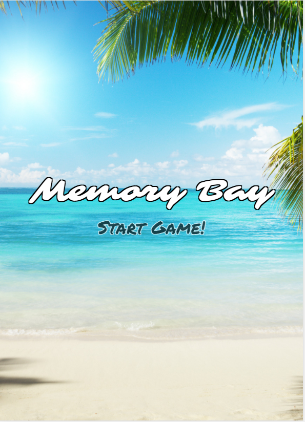
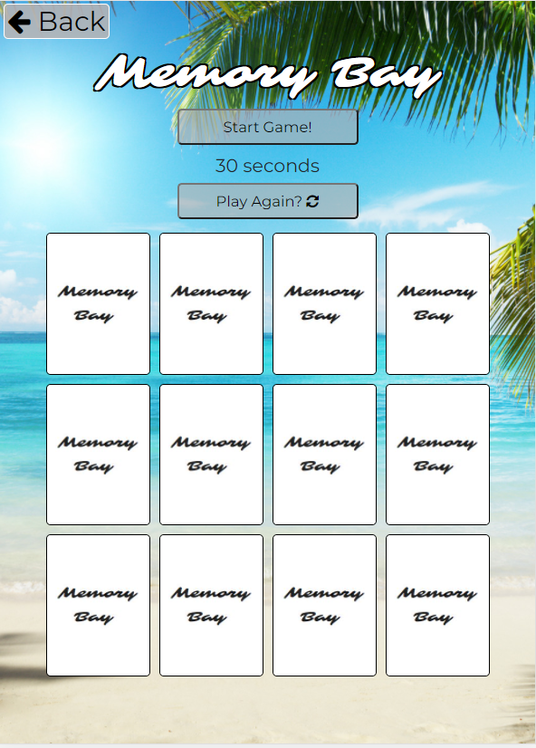
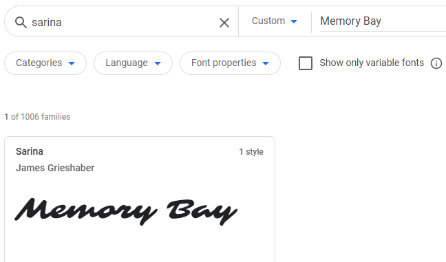

# Milestone Project Two - Memory Bay

For my second project to display my skills in JavaScript I have created a memory card matching game with a theme reflecting my favourite place to be this year, the beach.The game is designed to test your memory, the game has a 30 second timer to complete the game to add the edge of a challenge!

I have used a mix of HTML, CSS and JavaScript to create this interactive game. 

[Click here to view My Project](https://amykeedwell.github.io/2-Milestone-Project-Memory-Bay/)

[Click here to view my Repository](https://github.com/AmyKeedwell/2-Milestone-Project-Memory-Bay)

# UX

This game is designed to be a relaxing game aimed at all age groups. The premise is to complete the game by matching all of the cards within the time limit of 30 seconds. 

# Mock Up
I created an initial mockup of my game using Figma

*My design has stayed the same as my intial creation, although there are a few aspects that I struggled to implement:*
* *I initally wanted my game to be designed to have three different levels of difficulty: Easy, Medium and Hard with each level, increasing the number of cards to match at each level. I found that with the time I had to create my project, I would have struggled to code and style all different sizes so I decided to create a game with one level that I could concentrate on perfecting!*
* *I wanted a type of score system initally, but instead opted for the game to be completed within a set time for the user to know if they have won the game!*
* *I did want to add background music to the game, this was to reinforce the relxing beach theme of the game.*

# User Stories

* A user who plays the game can easily navigate to the game page.

* A user who plays the game can easly understand the functionality of the game is simple and easy to understand without the need for directions.

* A user who plays the game can challenge themselves to complete the game in the fastest time.

# Design

* I decided to go for a two page format, with a Home Page with a Start Game button to take the user to main Game Page.

* I opted for cursive google fonts as complimented the theme well, the main one being Sarina. 

* I decided to style the back face of my cards with a simple white background and the name of the game in my selected font to make it stand out from the background and look nice and clean. 

* I styled my buttons as a light grey, slightly translucent to still show the background image while ensuring they stand out and are clear for the user. 

* I style my cards to sit on the page in a 4 x 3 layout to help the game look balanced on both desktop and mobile devices. 

# Features 

* **HomePage** 
    * containing the name of my memory game with the background image which is consistant throughout and a flashing 'Start Game' button to grab attention for the user to click and begin the game

* **Back Button** 
    * for ease of navigation, I added a back button for the user to be able to easily navigate back to the Home Page if required.

* **Title** 
    * I wanted my title to be very eye catching and chose a [google font](https://fonts.google.com/?query=sarina&preview.text=Memory%20Bay&preview.text_type=custom) called Sarina as it gave me beachy vibes!

* **Start Game Button** 
    * I decided to add a button which needs to be clicked in order to unlock the game board and begin the game, this also starts the timer countdown (I did initially have the timer starting on page refresh but found this was not very user friendly!)

* **Timer** 
    * I added a 30 second timer to give the game the element of challenge. The user will recieve different pop up's displayed on screen. If they fail to match all the cards within the allocated time, they will get the 'Out of Time' modal. If they do match all cards within the allocated time, they will get the 'You Win!' modal.

* **Play Again Button** 
    * The play again button is functional to refresh the whole page enabling the user to click Start Game and play again and again with ease!

* **The Game** 
    * The game is a memory card matching game made of 12 game cards with beach themed images

* **You Win!**
    * I created a modal which pops up when all cards are matched in under 30 seconds, it pop's up with the message 'You Win' and a button to click to play again which will refresh the page.

* **Out of Time!**
    * If the 30 second timer runs to 0 before the player has successfully matched all of the cards, they will get a pop up with the message 'Out of Time', 'You ran out of time, Play Again?' this modal also has a button for the user to click to refresh the page and try again to win the game!

## Futher features to implement
* Different levels which scales from Easy (12 cards), Medium (16 cards), and Hard (24 cards).

* Sound effects when two cards are matched. 

* Soothing background music of waves with a button to toggle on and off. 

# Technologies Used

This project makes use of:
* [HTML](https://developer.mozilla.org/en-US/docs/Web/HTML)
    * HTML for structure.
* [CSS](https://developer.mozilla.org/en-US/docs/Web/CSS)
    * CSS for Styling.
* [JavaScript](https://www.javascript.com/)
    * To add functionality to the game 
* [JQuery](https://jquery.com/)
    * Used to add functionality to my timer and buttons throughout the page
* [Google Chrome](https://www.google.com/chrome/)
    * Used for browser and dev tools.
* [Google](https://www.google.co.uk/)
    * Google was used for research.
* [Google Fonts](https://fonts.google.com/)
    * Used for typogra phy
* [Bootstrap](https://getbootstrap.com/)
    * HTML and CSS Framework, Grid System - Columns and Rows from Bootstrap.
* [Font Awesome](https://fontawesome.com/)
    * Used to add icons throughout the page.
* [Figma](https://www.figma.com/)
    * Used to make my final wireframe.
* [Git](https://git-scm.com/)
    * Git used for Version Control.
* [GitHub](https://github.com/)
    * Repository hosted on GitHub.
* [Github Pages](https://amykeedwell.github.io/Milestone-Project-Resume/)
    * Website hosted on Github Pages.
* [Am I Responsive](http://ami.responsivedesign.is/)
    * Testing responsiveness of the website.
* [HTML Validator](https://validator.w3.org/)
    * Validated HTML code by direct input to check for any errors.
* [CSS Validator](https://jigsaw.w3.org/css-validator/)
    * Validated CSS code by direct input to check for any errors.
* [HTML Formatter](https://www.freeformatter.com/html-formatter.html#ad-output)
    * Checked that HTML code is formatted and indented correctly.

# Testing
* **Responsive Design in Dev Tools** Tested responsiveness using google dev tools. I tested the following types:

    * iPhone 5/SE (portrait: 320x568 & landscape: 568x320)
    * Galaxy S5/Moto G4 (portrait: 360x640 & landscape: 640x360)
    * iPhone 6/7/8 (portrait: 375x667 & landscape: 667x375)
    * iPhone X (portrait: 375x812 & landscape: 812x375)
    * Pixel 2 (portrait: 411x731 & landscape: 731x411)
    * Pixel 2 XL (portrait: 411x823 & landscape: 823x411)
    * iPhone 6/7/8 Plus (portrait: 414x736 & landscape: 736x414)
    * iPad (portrait: 768x1024 & landscape: 1024x768)
    * iPad Pro (portrait: 1024x1366 & landscape: 1366x1024)
    
* **Responsive Design Testing with Family and Friends** I sent my GitHub Pages link to family and friends to test and provide feedback.
    
    * Samsung S9 - Sent myself my GitHub Pages link and checked functionality, I found no problems playing on andriod, game and all links functional and displayed on a single non-scrolling page. (I did find when holding the phone sideways, it only displays one row of cards at a time, this was expected but does make the game unplayable in this format)

    * Samsung S10 - same as the above.

    * iPad -  Sent my family the link, they reported that the game did not function as expected, this is due to a known bug described in section below.

    * Google Chrome - The game works flawlessly on google chrome as designed and tested in this browser.

    * Internet Explorer - I found that the game does not function in IX. The start game button does not seem to function so the board remains locked meaning that the game cannot be played (I have been unable to reach a conclusion as to why this is and unfortunately not enough time to attemp to fix this!)

* **Game Functionality** Thoroughly tested the dynamics of the game while building it to make sure all aspects work correctly.
    
    * Tested that the gameboard will remain locked until the user initiates the game by clicking the 'Start Game' button.
    
    * Tested that the timer will only start counting down once the 'Start Game' button is clicked.
    
    * Tested that the player can only click two cards at a time, the third card will react to the fact its clicked but will not flip around.
    
    * Tested that if the player fails to match all of the cards before the countdown ends, they recieve a pop-up saying 'You ran out of time' with an option to play again.
    
    * Tested that if a player succeeds in matching all cards before the countdown ends, they recieve a pop-up saying 'You Won' with an option to play again. 

    * Tested that when the back button is pressed, it successfully takes the user back to the home page. 

* **Peer Code Review** Posted my code in the peer-code-review section on slack for fellow students to test and give any feeback and constructive criticism. 
    * Added styling to make the text in my Start Game button flash to make it more prominant as advised did't stand out enough and players tried to start playing the game while the gameboard was still locked.
    
    * iOS user flagged a display glitch where the front-face cards do not show when the user clicks a card to flip. Instead it momentarily displays the image then flips to the inverted back face card.

* **Code Validators** to ensure my code is written in the correct format and there are no errors.
    * [HTML Validator](https://validator.w3.org/) 

    

    * [CSS Validator](https://jigsaw.w3.org/css-validator/)

    

## Known Bugs 
 During testing I found that all iOS users encourtered a display glitch where the front-face cards do not show when the user touches a card to flip. Instead it momentarily displays the image then flips to the inverted back face card. This can be seen below:

Also, Internet Explorer - I found that the game does not function in IX. The start game button does not seem to function so the board remains locked meaning that the game cannot be played (I have been unable to reach a conclusion as to why this is and unfortunately not enough time to attemp to fix this!)

# Deployment
The project is hosted on GitHub Pages

The process involved:

* Host a git repository on GitHub.

* Create project in GitPod saving each big change for version control to GitHub.

* Open your project repository in GitHub.

* Click on settings.

* Scroll down to the GitHub Pages section.

* Click on source and select master branch.

* After the page refreshes you will have a link to your deployed website.

* Final product now hosted on GitHub Pages.

To deploy your own version of the website:

* Have git installed

* Visit the repository

* Click 'Clone or download' and copy the code for http

* Open your chosen IDE (Cloud9, VS Code, etc.)

* Open a terminal in your root directory

* Type 'git clone ' followed by the code taken from github repository

* When this completes you have your own version of the website

* Feel free to make any changes to it

* The website can be run by opening one of the HTML files within a web browser

* Visit the link provided

* Your website with any made changes will appear

* Saved changes to the website will appear here after refreshing the page

The benefits of hosting your website on GitHub pages is that any pushed changes to your project will automatically update the website. Development branches can be created and merged to the master when complete.

It may take a moment for changes to appear on the hosted website.

During development the site is written in VS Code. It is run using Live Server plugin for VS Code.

# Credits 

## Content

To help me create the memory game javascript itself, I watched this tutorial by 'freeCodeCamp.org' and used the tips while changing the code to fit my own code and needs for the game https://www.youtube.com/watch?v=ZniVgo8U7ek

To create my timer function I took inspiration from the code found at 'https://tonnygaric.com/blog/create-a-seconds-countdown-in-6-lines-of-javascript'
## Acknowledgements

I would like to acknowledge all the help of the Code Institute Tutors who helped me overcome technical issues and make my vision come to life. 