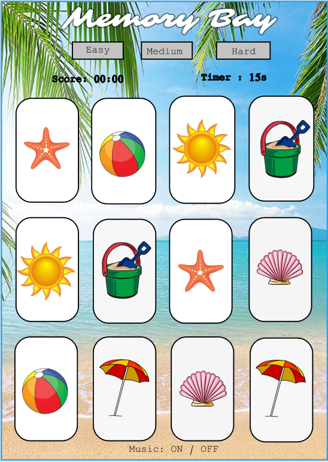
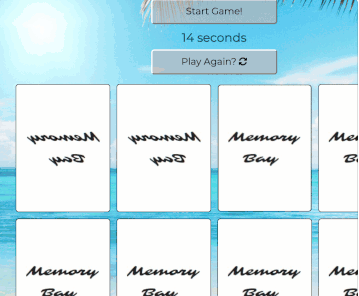
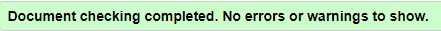
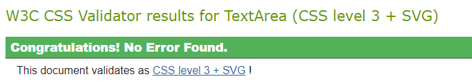

# Milestone Project Two - Memory Bay

For my second project to display my skills in JavaScript I have created a memory card game with a theme reflecting my favourite place to be this year, the beach.

I have used a mix of HTML, CSS and JavaScript to create this interactive game. 

[Click here to view My Project](https://amykeedwell.github.io/2-Milestone-Project-Memory-Bay/)

[Click here to view my Repository](https://github.com/AmyKeedwell/2-Milestone-Project-Memory-Bay)

# UX

This game is designed to be a relaxing game aimed at all age groups. 

# User Stories

# Mock Up
I created an initial mockup of my game using Figma

*My design has stayed the same as my intial creation, although there are a few aspects that I struggled to implement:*
* *I initally wanted my game to be designed to have three different levels of difficulty: Easy, Medium and Hard with each level, increasing the number of cards to match at each level. I found that with the time I had to create my project, I would have struggled to code and style all different sizes so I decided to create a game with one level that I could concentrate on perfecting!*
* *I wanted a type of score system initally, but instead opted for the game to be completed within a set time for the user to know if they have won the game!*
* *I did want to add background music to the game, this was to reinforce the relxing beach theme of the game, although this would be a great feature I deemed it to not be significant enough to implement.*

# Design

* I decided to go for a two page format, with a Home Page with a Start Game button to take the user to main Game Page.

# Features

* **HomePage** containing the name of my memory game with the background image which is consistant throughout and a flashing 'Start Game' button to grab attention for the user to click and begin the game

* **Back Button** for ease of navigation, I added a back button for the user to be able to easily navigate back to the Home Page if required.

* **Title** I wanted my title to be very eye catching and chose a [google font](https://fonts.google.com/?query=sarina&preview.text=Memory%20Bay&preview.text_type=custom) called Sarina as it gave me Baywatch vibes!

* **Start Game Button** 

* **Timer**

* **Play Again Button** 

* **The Game** 

# Technologies Used

This project makes use of:
* [HTML](https://developer.mozilla.org/en-US/docs/Web/HTML)
    * HTML for structure.
* [CSS](https://developer.mozilla.org/en-US/docs/Web/CSS)
    * CSS for Styling.
* [Google Chrome](https://www.google.com/chrome/)
    * Used for browser and dev tools.
* [Google](https://www.google.co.uk/)
    * Google was used for research.
* [Google Fonts](https://fonts.google.com/)
    * Used for typogra phy
* [Bootstrap](https://getbootstrap.com/)
    * HTML and CSS Framework, Grid System - Columns and Rows from Bootstrap.
* [Font Awesome](https://fontawesome.com/)
    * Used to add icons throughout the page.
* [Figma](https://www.figma.com/)
    * Used to make my final wireframe.
* [Git](https://git-scm.com/)
    * Git used for Version Control.
* [GitHub](https://github.com/)
    * Repository hosted on GitHub.
* [Github Pages](https://amykeedwell.github.io/Milestone-Project-Resume/)
    * Website hosted on Github Pages.
* [Am I Responsive](http://ami.responsivedesign.is/)
    * Testing responsiveness of the website.
* [HTML Validator](https://validator.w3.org/)
    * Validated HTML code by direct input to check for any errors.
* [CSS Validator](https://jigsaw.w3.org/css-validator/)
    * Validated CSS code by direct input to check for any errors.
* [HTML Formatter](https://www.freeformatter.com/html-formatter.html#ad-output)
    * Checked that HTML code is formatted and indented correctly.

# Testing
* **Responsive Design** Tested responsiveness using google dev tools. I tested the following types:

    * iPhone 5/SE (portrait: 320x568 & landscape: 568x320)
    * Galaxy S5/Moto G4 (portrait: 360x640 & landscape: 640x360)
    * iPhone 6/7/8 (portrait: 375x667 & landscape: 667x375)
    * iPhone X (portrait: 375x812 & landscape: 812x375)
    * Pixel 2 (portrait: 411x731 & landscape: 731x411)
    * Pixel 2 XL (portrait: 411x823 & landscape: 823x411)
    * iPhone 6/7/8 Plus (portrait: 414x736 & landscape: 736x414)
    * iPad (portrait: 768x1024 & landscape: 1024x768)
    * iPad Pro (portrait: 1024x1366 & landscape: 1366x1024)

* **Peer Code Review** Posted my code in the peer-code-review section on slack for fellow students to test and give any feeback and constructive criticism. 
    * Added styling to make the text in my Start Game button flash to make it more prominant as advised did't stand out enough and players tried to start playing the game while the gameboard was still locked.
    
    * iOS user flagged a display glitch where the front-face cards do not show when the user touches a card to flip. Instead it momentarily displays the image then flips to the inverted back face card. This can be seen below:
    

* **Code Validators** to ensure my code is written in the correct format and there are no errors.
    * [HTML Validator](https://validator.w3.org/) 

    

    * [CSS Validator](https://jigsaw.w3.org/css-validator/)

    

## Known Bugs 

# Deployment
The project is hosted on GitHub Pages

The process involved:

* Host a git repository on GitHub.

* Create project in GitPod saving each big change for version control to GitHub.

* Open your project repository in GitHub.

* Click on settings.

* Scroll down to the GitHub Pages section.

* Click on source and select master branch.

* After the page refreshes you will have a link to your deployed website.

* Final product now hosted on GitHub Pages.

To deploy your own version of the website:

* Have git installed

* Visit the repository

* Click 'Clone or download' and copy the code for http

* Open your chosen IDE (Cloud9, VS Code, etc.)

* Open a terminal in your root directory

* Type 'git clone ' followed by the code taken from github repository

* When this completes you have your own version of the website

* Feel free to make any changes to it

* The website can be run by opening one of the HTML files within a web browser

* Visit the link provided

* Your website with any made changes will appear

* Saved changes to the website will appear here after refreshing the page

The benefits of hosting your website on GitHub pages is that any pushed changes to your project will automatically update the website. Development branches can be created and merged to the master when complete.

It may take a moment for changes to appear on the hosted website.

During development the site is written in VS Code. It is run using Live Server plugin for VS Code.

# Credits 

## Content

To help me create the memory game javascript itself, I watched this tutorial by 'freeCodeCamp.org' and used the tips while changing it to fit my own code and needs for the game https://www.youtube.com/watch?v=ZniVgo8U7ek

To create my timer function I took inspiration from the code found at 'https://tonnygaric.com/blog/create-a-seconds-countdown-in-6-lines-of-javascript'
## Acknowledgements

I would like to acknowledge all the help of the Code Institute Tutors who helped me overcome technical issues and make my vision come to life. 